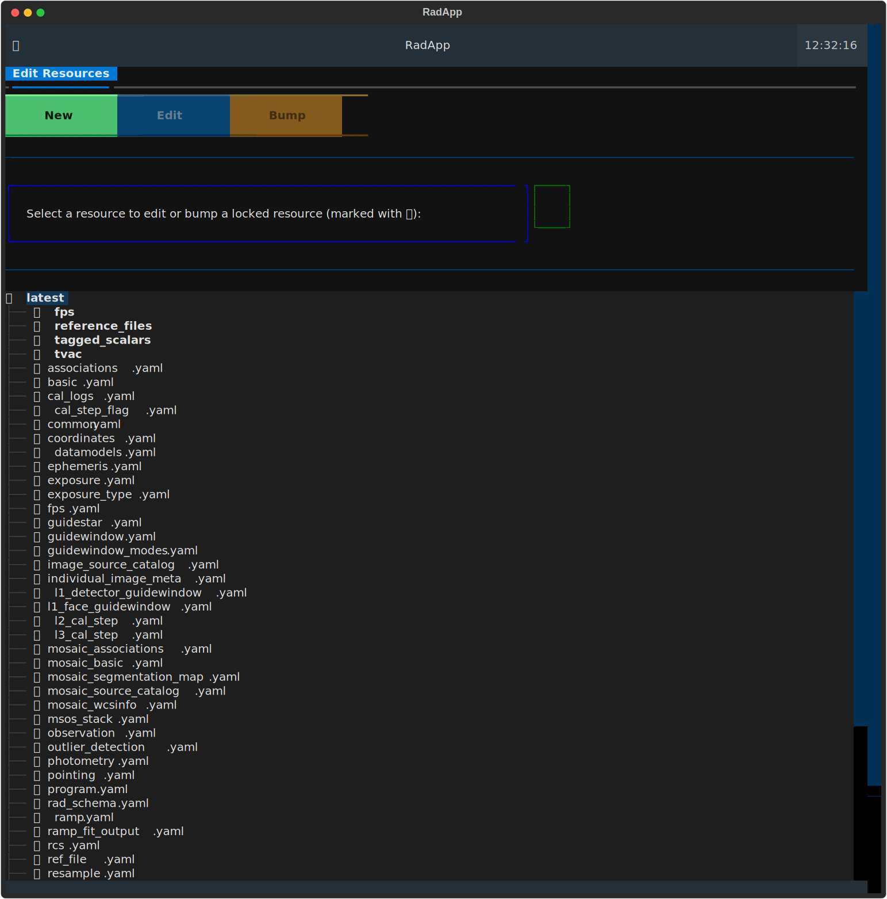
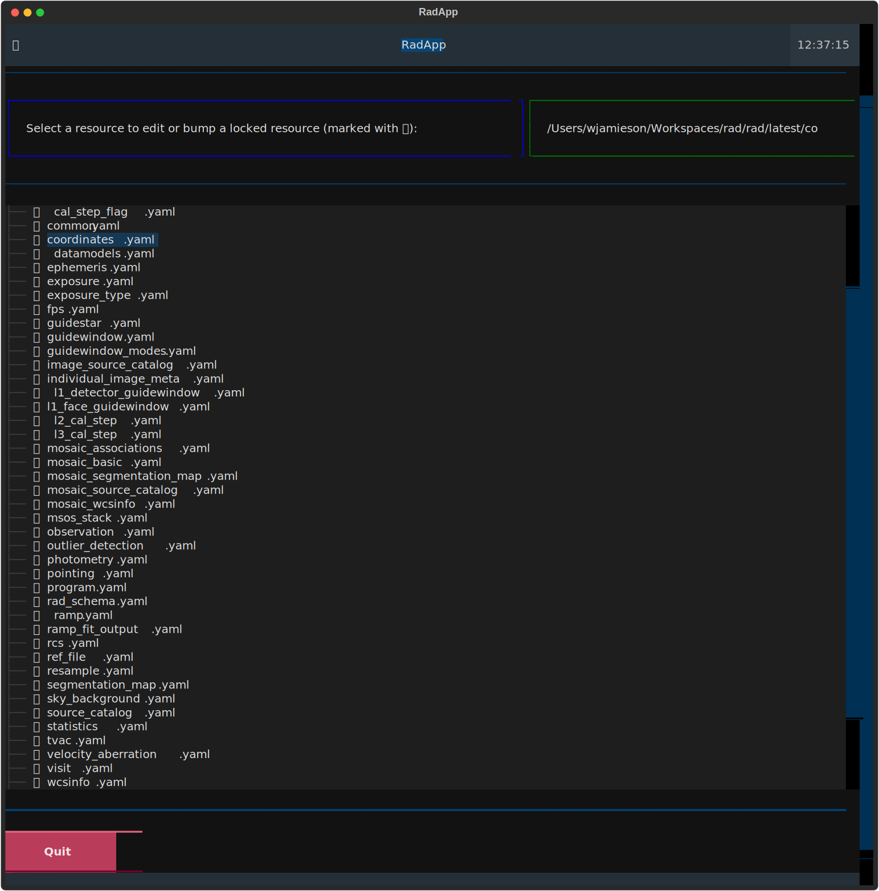
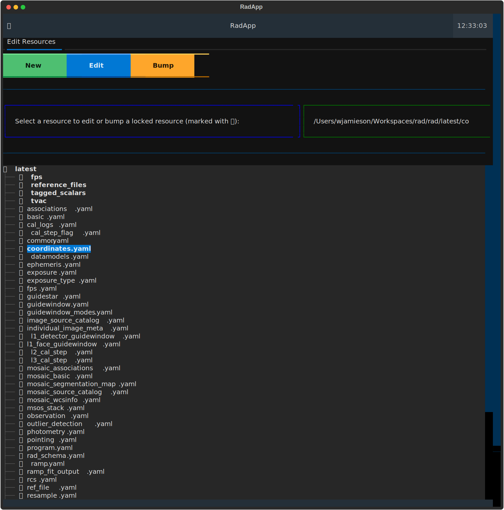
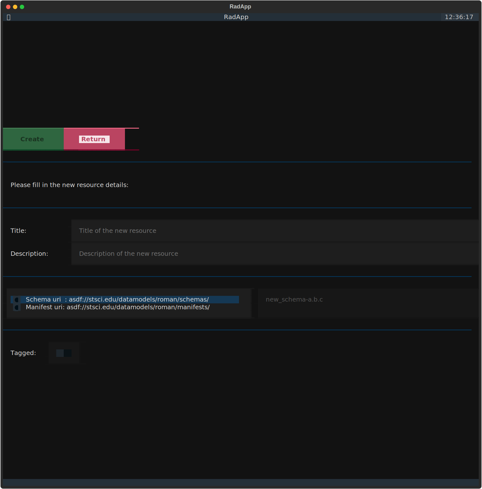
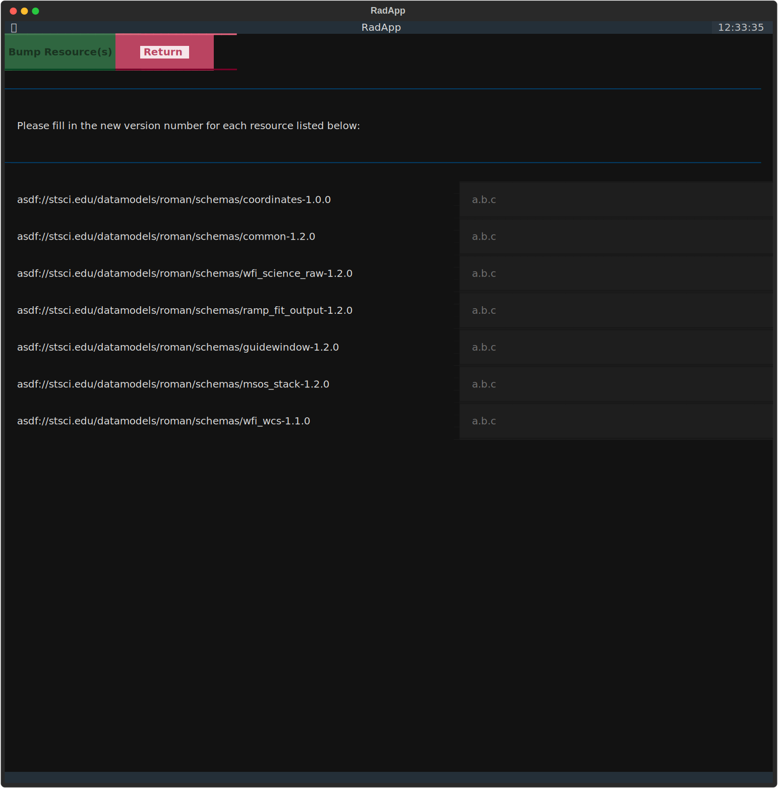
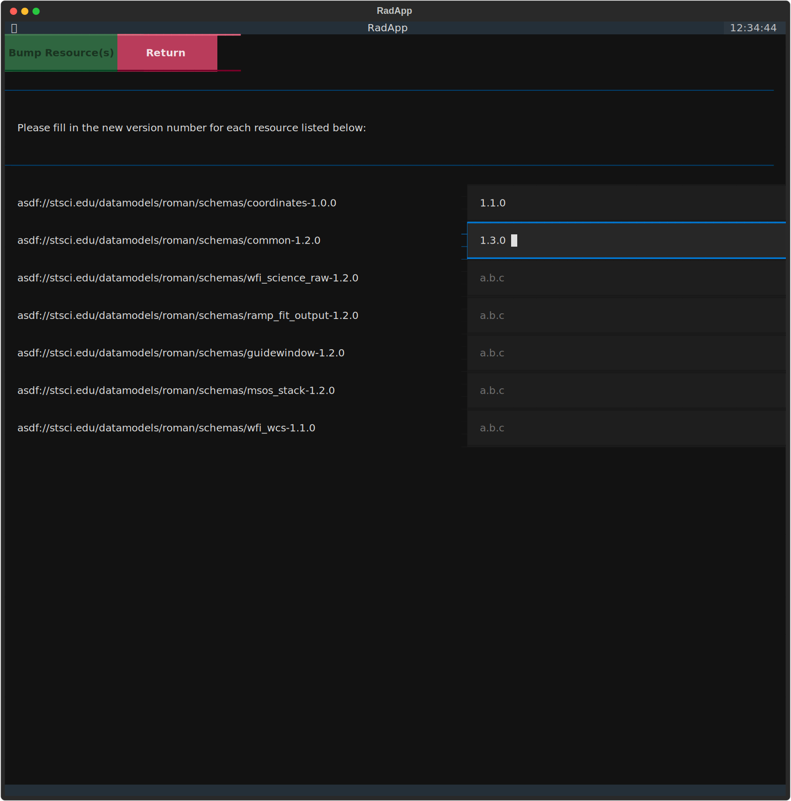
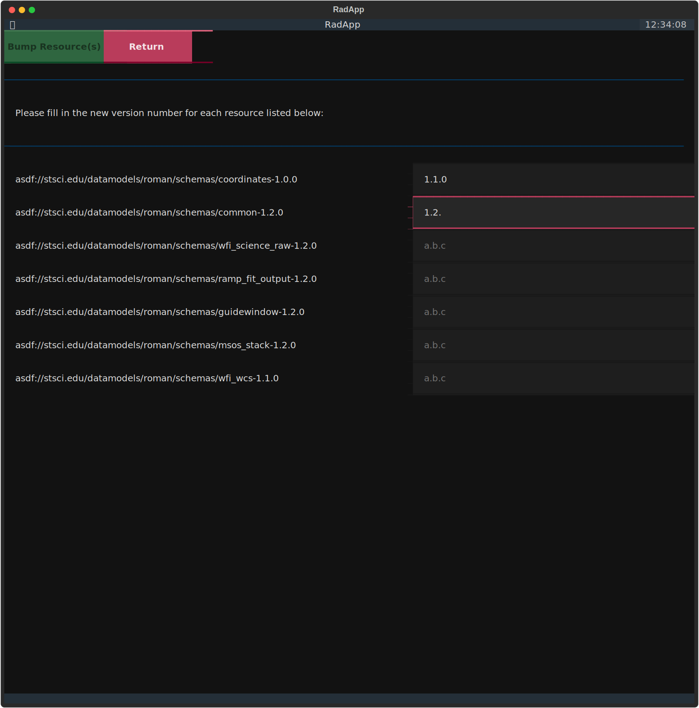

.. _rad_helper:

Rad Helper Script
=================

The RAD helper script is an interactive terminal App that automates the process
of creating, editing, and bumping the RAD schemas. Its primary purpose is to help
manage if/when the version of a RAD resource (schema or manifest) needs to be updated
and it ensures that all the URIs and tags throughout the RAD resources are updated
accorrdingly.

The helper script can be run from the terminal at the root of the RAD repository
using the command:

.. code:: bash

    python scripts/rad_helper.py

.. note::

    The helper script assists in figuring out when a version bump is needed by
    analyzing the git history of RAD. It does this by scanning through the tags
    in the git repository looking for ones corresponding to a RAD release. It then
    reads the RAD resources at that release time, recording all the URIs used.

    In order to do this, the helper script will synchronize the your local repository's
    git tags with the main RAD repository's git tags. This way it can accurately pick
    up any RAD releases that have been made since the last time the git tags were
    synchronized. This is important because forking and cloning git repositories
    does not automatically synchronize the git tags, so the helper script will
    automatically do this for you.

When you run the helper script, it will take a few seconds to actually start up.
This is due to the fact that it is processing the git history and pulling a lot of
information from it. This is only needs to be done once per app run so the performance
of the app will remain snappy for actual usage.

You should get a page that looks something like:

You can navigate the app using a keyboard and mouse. Additionally, you can use ``<TAB>``,
and the arrow keys to navigate the app, with ``<ENTER>`` to select/interact with an item.

Note that the main functionalities of the app are available on the main screen by clicking
on the tabs along the top of the screen. Currently, there is only one tab, the ``Edit Resources`` tab,
but future functionalities will be added as additional tabs.

Quitting the App
----------------
Note at the bottom of the main screen of the app, there is a red button labeled ``Quit``, processing
this will exit the app immediately:

Moreover, you can hit the ``<q>`` key on your keyboard in any non-text input field to quit the app
at any time as well.

.. warning::
    Any unsaved/applied changes will be lost when the app is quit.

.. Note::
    There are some additional global keyboard shortcuts that can be used:

    * ``<d>`` toggles between dark and light mode, with the default being dark mode.
    * ``<e>`` toggles to the edit tab.

Edit Resources Tab
------------------

As the name, ``Edit Resources``, suggests this tab facilitates the editing of the
RAD resources in a way that maintains both the versioning and makes sure a given
resource is properly linked into RAD. It provides three general functions

#. ``New`` button in green at the top of the tab will start the process to create a brand new resource.
#. ``Edit`` button in blue at the top of the tab will start the process to edit an existing resource.
#. ``Bump`` button in yellow at the top of the tab will start the process to bump a schema version.

These buttons maybe grayed out indicating they are disabled. This occurs when the given function is
not applicable to the selected resource, see below.

Below these buttons there is an interactive directory tree that allows you to
navigate through the latest RAD resources. Each item in the tree is marked with
on of the following icons:

* 📂/📁 indicating a directory (clicking on a directory will toggle the expansion of the contents)
* 📄 indicating a schema that does not need a version bump in order to be edited.
* 🔒 indicating a schema that needs a version bump prior to editing.

You can click on any of these items to select it, with clicking on a directory
expanding or collapsing its contents. When you select a resource file, its path
will be displayed at the top of the tab next to the text prompt.

By selecting a resource will enable the applicable buttons at the top of the tab. Such as:

``New`` Button
^^^^^^^^^^^^^^

The ``New`` button is always enabled, and clicking it will launch a new dialog
screen on top of the main screen, which looks like:

This screen takes you through the process of creating a minimal viable RAD resource.
The options are as follows:

#. Title (always required)
#. Description (required for tagged schemas and manifests)
#. Select schema or Manifest (always required)
#. The URI suffix, to be added to the schema/manifest URI prefix (always required)
#. If the resource should be tagged (optional, and only applies to the schema selection)

In addition to these options there are two buttions at the top of the screen:

* ``Create`` button in green will create the resource with the given options.
* ``Return`` button in red will close the current screen and return to the main screen
  without creating a resource.

.. note::
    The URI suffix must end with a ``-<semantic_version_number>`` suffix, where
    ``<semantic_version>`` is a valid semantic version string, e.g. ``1.0.0`` or
    ``2.3.4``. This is to ensure that the resource is properly versioned.

    Moreover, the final URI is checked to ensure that it does not conflict with any
    existing resource URIs in RAD.

    If both of these conditions are met, the input field's boarder will turn blue
    otherwise it will turn red indicating that the input is invalid.

.. note::
    The ``Create`` button will only be enabled if all the options are configured or
    entered correctly. If the button is grayed out, then one or more of the options
    will need to be updated.

    There are three basic types of resources that can be created:

    #. An untagged schema, which requires:

       * Title
       * Selecting the schema uri prefix
       * URI suffix
       * Tag switch off

    #. A tagged schema, which requires:

       * Title
       * Description
       * Selecting the schema uri prefix
       * URI suffix
       * Tag switch on

    #. A manifest, which requires:

       * Title
       * Description
       * Selecting the manifest uri prefix
       * URI suffix
       * The tag switch will be disabled and set to off.

.. note::
    If a tagged schema is created and the datamodels manifest is currently locked,
    then prior actually creating the schema, clicking ``Create`` will first open
    a bump dialog screen for you to bump the datamodels manifest version, see
    below for more information.

``Edit`` Button
^^^^^^^^^^^^^^^

The ``Edit`` button is enabled whenever you select any resource in the directory
tree. When you click it, your configured terminal text editor, ``$EDITOR``, will
open the selected resource file for editing. The file you will be editing will be
a temporary file that contains a copy of the current resource file, this way if you
exit prematurely, the resource will not be modified. Once you save and close the
text editor, the app will automatically attempt to apply your changes to the resources.

.. note::
    If the environment variable ``$EDITOR``, is not set then the ``vim`` the app
    will attempt to use the ``vim`` text editor.

.. note::
    If you are editing a locked resource, then if your changes require a version
    bump, the app will open the bump dialog screen (see below) prior to actually
    applying your changes to the resources. At which point it will bump all the
    relevant resources, including the one you are editing, and then apply your
    changes to the resource in question.

    If you exit from the bump dialog the changes you made will be saved to the
    ``<rad_repository_directory>/unsaved_changes/`` directory under the name of
    the file you were editing, so you don't loose any involved changes you made.

``Bump`` Button
^^^^^^^^^^^^^^^

The ``Bump`` button is only enabled when you select a resource that is locked, meaning
that it requires a version bump prior to any major changes being made to it.

When you click it, a dialog screen will open that looks like:

This screen has two buttons at the top:

#. ``Bump`` button in green will bump the versions of all needed resources. This
   will only be enabled once the version numbers are all filled in correctly.
#. ``Return`` button in red will close the current screen and return to the main screen
   without bumping any resources.

Followed by the buttions is a scrollable list of all the resources that will need
to have their versions bumped, with there current URI followed by a text input
field where you can enter the new version number for that resource.

.. note::

    When bumping a resource, there maybe a "cascade" of resources that also
    need to be bumped due to URI references within those resources. All of these
    resources will be listed in the resource list, they will be ordered starting
    with the resource you selected to bump followed by all the resources directly
    referencing it, and so on.

When entering the version numbers, they are checked to ensure two things:

#. The version number is a valid semantic version string, e.g. ``1.0.0`` or
   ``2.3.4``.
#. The version number is strictly greater than the current version number of the resource
   in terms of semantic versioning.

If both of these conditions are met, the input field's boarder will turn blue such as:

Otherwise, it will turn red indicating that the input is invalid such as:

